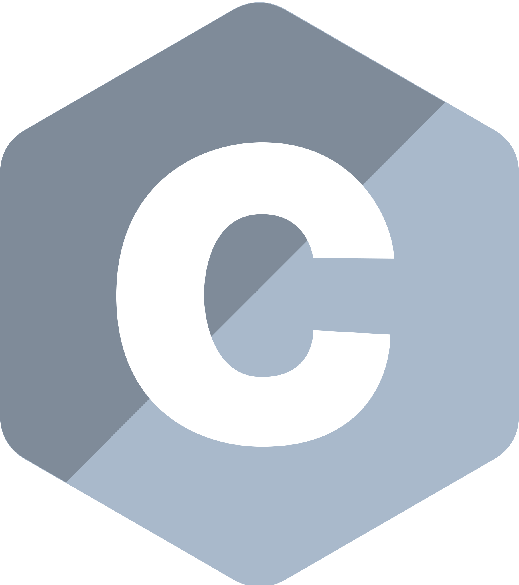

<h1 align="center">
  
</h1>

<h5 align="center">
  <code><a href="https://www.linkedin.com/in/rasvetovvv" title="LinkedIn Profile"> LinkedIn</a></code>
  <code><a href="https://www.hackerrank.com/rasvetovvv" title="HackerRank Profile"> HackerRank</a></code>
  <code><a href="https://stackoverflow.com/" title="Stack Overflow Profile"> Stack Overflow</a></code>
  <code><a href="https://www.instagram.com/rasvetovvvkys/" title="Instagram Profile"> Instagram</a></code>
</h5>
 

  rasvetovvv
   
  How to reach me: <a href="mailto: rasvetovvv@gmail.com">rasvetovvv@gmail.com</a>

<h2 align="center"> Languages & Frameworks & Tools & Abilities </h2>
 

  <code></code>
  <code></code>
  <code></code>
  <code></code>
  <code></code>
  <code></code>
  <code></code>
  <code></code>
  <code></code>
  <code></code>
  <code></code>
  <code></code>
  <code></code>
  <code></code>
  <code></code>
  <code></code>
  <code></code>
  <code></code>
  <code></code>

